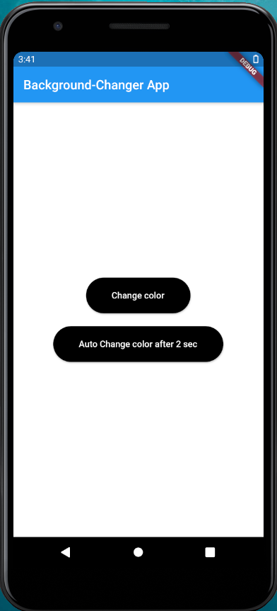
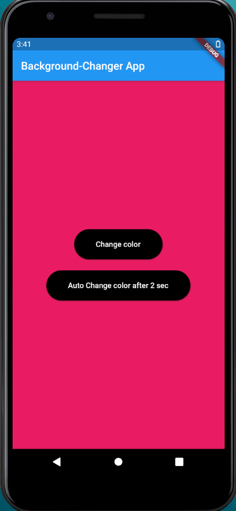
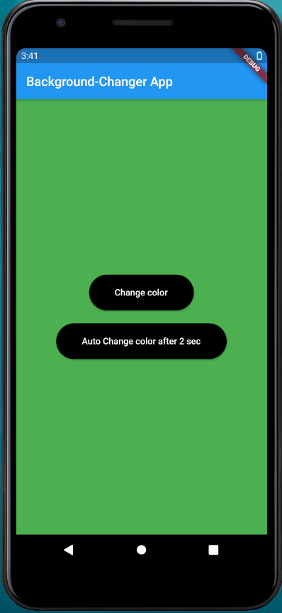

# Background-Changer_app
### About the app
<b>Built Using</b>
<ul><li>Flutter</li></ul>

This Flutter app changes the color of background when you click on the "Change color" button and when you click on "Auto Change color after 2 sec" button it changes the background color after every 2 seconds.

<b>Some Snaps from the App:-</b>

 &nbsp; &nbsp;  &nbsp; &nbsp; &nbsp; &nbsp;  &nbsp; &nbsp;
 &nbsp; &nbsp;  &nbsp; &nbsp; &nbsp; &nbsp;  &nbsp; &nbsp;
 &nbsp; &nbsp;  &nbsp; &nbsp; &nbsp; &nbsp;  &nbsp; &nbsp; 

